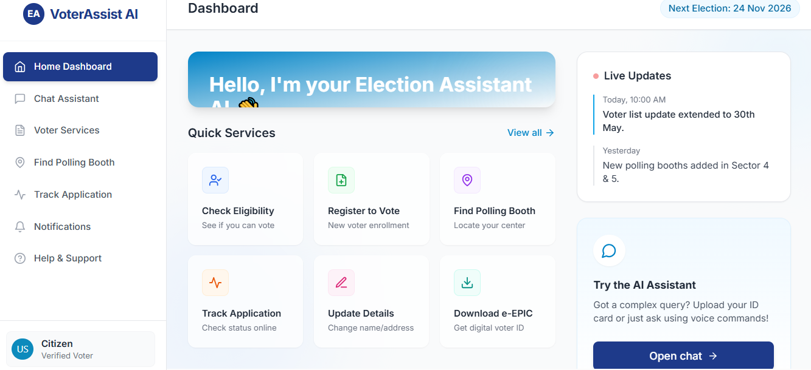
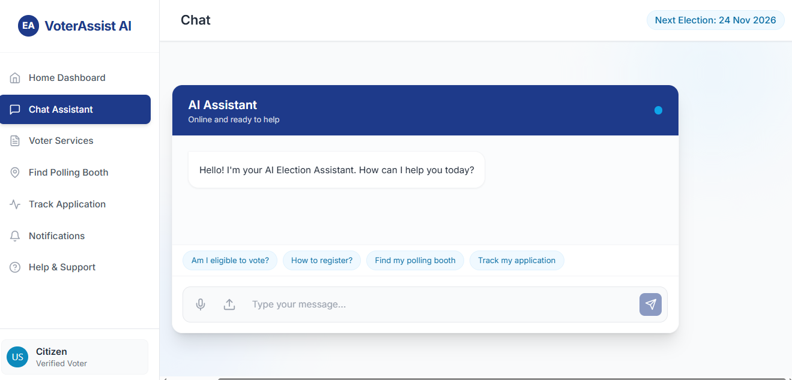
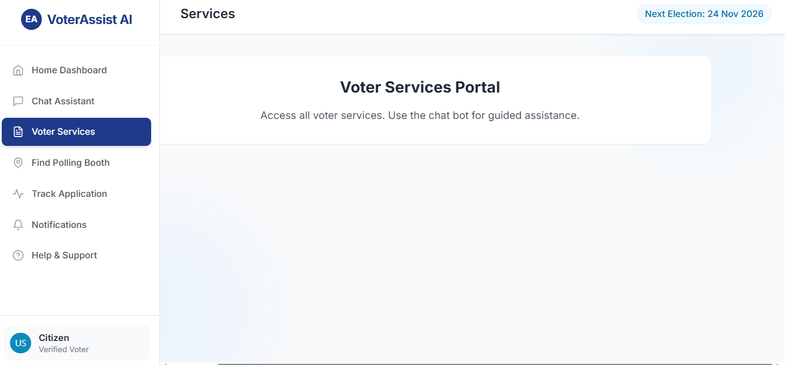
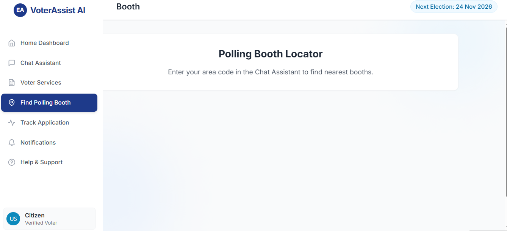
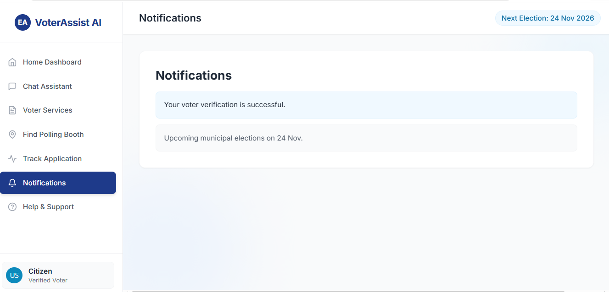
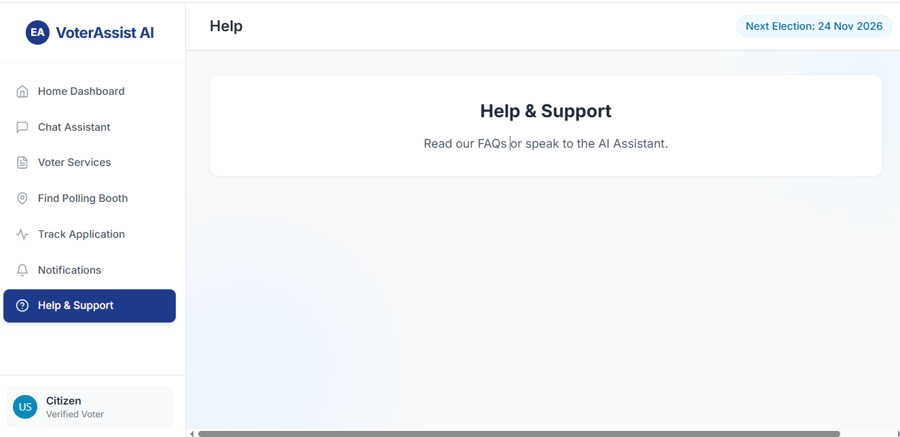

# AI-Powered Election Assistant

A full-stack web application designed to serve as a modern, government-style election assistant using AI chatbots, voice processing, and image OCR.

## Tech Stack
* **Frontend:** React (Vite), Tailwind CSS, Axios, Lucide React
* **Backend:** Python (FastAPI), Uvicorn, OpenAI API, Pytesseract (OCR), SpeechRecognition

## Instructions to Run

### Backend Setup
1. Open a terminal and navigate to the backend directory:
   ```bash
   cd backend
   ```
2. Create a virtual environment (optional but recommended):
   ```bash
   python -m venv venv
   source venv/bin/activate  # Mac/Linux
   venv\Scripts\activate   # Windows
   ```
3. Install dependencies:
   ```bash
   pip install -r requirements.txt
   ```
4. Set up Environment Variables:
   Create a `.env` file in the `backend` folder and add your OpenAI Key (Optional, it runs without it using mock data):
   ```
   OPENAI_API_KEY=your_actual_api_key
   ```
5. Run the FastAPI server:
   ```bash
   python main.py
   ```
   *(Backend starts on http://localhost:8000)*

### Frontend Setup
1. Open a new terminal and navigate to the frontend directory:
   ```bash
   cd frontend
   ```
2. Install dependencies:
   ```bash
   npm install
   ```
3. Run the Vite development server:
   ```bash
   npm run dev
   ```
   *(Frontend starts on http://localhost:5173)*

### Features Implemented
* **Dashboard UI:** A modern, clean, Dashboard with animated glassmorphism cards and layout.
* **AI Chat Assistant:** Detects intent and responds intelligently (Integrates via FastAPI backend, mocking if no api key provided).
* **Voice Input:** frontend allows mock voice command recording processed via SpeechRecognition on backend.
* **Image OCR:** Fast OCR parsing for uploaded images from frontend.
* **Responsive Sidebar:** complete routing using state for demonstration.

  ## Application Preview
##  Demo UI

| Dashboard | Chat Assistant |
|----------|----------------|
|  |  |

| Voter Services | Booth Finder |
|----------------|--------------|
|  |  |

| Notifications | Help |
|--------------|------|
|  |  |
